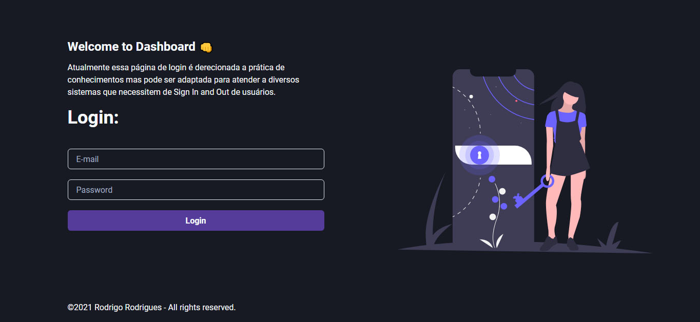

## Hello World
Esse projeto tem o intuito de implementar um sistema de login e logout de um dashboard ou sistema semelhante. Para isso, foi desenvolvido em: 
✔ NextJS 
✔ Chackra UI
✔ Sass
✔ Nookies
✔ Jwt-decode
✔ Axios

Vale lembrar que será necessário ter um backend para gerar os Tokens de autentificação e as autorizações de usuário. Existe esse backend disponível com o nome de [Auth-backend](https://github.com/Rodrigo-A-Rodrigues/auth-backend).

## Getting Started

Pirmeiro, rode esses comandos no seu terminal para instalar as dependências do projeto:

```bash
npm install
#or
yarn 
```
Para rodar sua aplicação utilize o camando:

```bash
npm run dev
# or
yarn dev
```

Será aberto em [http://localhost:3000](http://localhost:3000) o resultado desse projeto.

Logo, será possível visualizar a seguinte página: 



## Learn More

To learn more about Next.js, take a look at the following resources:

- [Next.js Documentation](https://nextjs.org/docs) - learn about Next.js features and API.
- [Learn Next.js](https://nextjs.org/learn) - an interactive Next.js tutorial.

You can check out [the Next.js GitHub repository](https://github.com/vercel/next.js/) - your feedback and contributions are welcome!

## Deploy on Vercel

The easiest way to deploy your Next.js app is to use the [Vercel Platform](https://vercel.com/new?utm_medium=default-template&filter=next.js&utm_source=create-next-app&utm_campaign=create-next-app-readme) from the creators of Next.js.

Check out our [Next.js deployment documentation](https://nextjs.org/docs/deployment) for more details.
